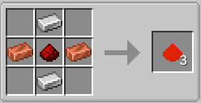
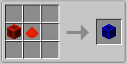
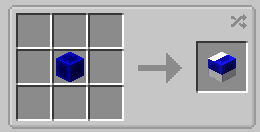
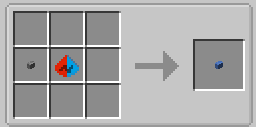
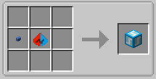

# RedstoneLink

## API Docs
- 中文文档: [docs/API_zh.md](./docs/API_zh.md)
- English docs: [docs/API_en.md](./docs/API_en.md)

## 重要声明
- 本项目包含 AI 辅助生成代码。
- 当前尚未完成全量人工代码审查。
- 使用本项目可能产生兼容性或稳定性风险，风险由使用者自行评估与承担。
- gradle构建使用了代理设置，这可能导致构建失败

## 项目概览
RedstoneLink 是一个基于 Minecraft Fabric 1.21.1 的红石远程信号传播模组。  
提供了触发器和接收器（连接核心）两大类，前者接受红石信号或右键交互，将切换或脉冲红石信号传播到后者；
后者可直接右键交互。

- 当前版本：`1.0.0alpha`
- 运行环境：Minecraft `1.21.1`、Fabric Loader `0.18.4`
- 构建工具：Gradle + Fabric Loom
- 许可证：GPL-3.0
- 提供api（未测试），详见docs/api文档
- 配置文件路径：.minecraft/config/redstonelink-server.properties

## 功能特性

### 1) 节点体系
- 连接核心（红石块）
- 连接核心（红石粉，只输出不输入；支持六面附着，非顶面附着时不参与相邻红石粉形态和信号传播演算）
- 连接核心透明变种（红石块 / 红石粉）

- 触发源：连接石按钮（切换）、连接木按钮（脉冲）、连接拉杆（切换）、两种受红石信号激发的触发器

### 2) 配对与联动
- 支持核心与触发源多对多配对
- 支持“已放置方块”与“物品”两种入口打开配对界面
- 支持多目标输入（批量设置链接，例如“1 2 3”）

### 3) 数据持久化与审计
- 存档级台账持久化（已分配、活跃、退役）
- 掉落物携带序号与链接快照
- 支持退役命令与审计命令


## 快速开始

### 开发构建
```bash
./gradlew build
```

### 仅处理资源（调试模型/贴图时常用）
```bash
./gradlew processResources
```

### 运行客户端（开发环境）
```bash
./gradlew runClient
```

### 快速体验测试地图
- 仓库内置可快速体验本模组的测试地图：`run/saves/test`。
- 启动开发客户端后，单人世界中选择该存档即可快速体验mod特性和与原版红石元件的互动。
- 该测试地图作为体验资产纳入版本管理，会随仓库更新同步。

## 安装与使用

### 安装步骤
1. 安装匹配版本的 Minecraft + Fabric Loader。
2. 将构建产物或已发布版本放入 `mods` 目录。

### 基础玩法
1. 放置核心与触发源。
2. 通过潜行+空手交互打开配对界面。
3. 写入目标序号后触发联动。

## 配方图与合成说明

### 有配方图项

### 1) 红石连接原件（`redstone_link_component`）


- 合成类型：有序合成（`crafting_shaped`）
- 合成逻辑：`I`（铁锭）上下、`C`（铜锭）左右、`R`（红石粉）中心
- 产出：`redstonelink:redstone_link_component` ×3

### 2) 连接核心-红石块（`link_redstone_core`）


- 合成类型：有序合成（`crafting_shaped`）
- 合成逻辑：中排按 `BL` 横向摆放
- 材料：`B = minecraft:redstone_block`，`L = redstonelink:redstone_link_component`
- 产出：`redstonelink:link_redstone_core` ×1

### 3) 连接核心-红石块（透明，`link_redstone_core_transparent`）


- 合成类型：无序合成（`crafting_shapeless`）
- 合成逻辑：`1 × link_redstone_core` 直接转换为透明变种（1:1）
- 产出：`redstonelink:link_redstone_core_transparent` ×1

### 4) 连接切换按钮（`link_toggle_button`）


- 合成类型：有序合成（`crafting_shaped`）
- 合成逻辑：中排按 `BL` 横向摆放
- 材料：`B = minecraft:stone_button`，`L = redstonelink:redstone_link_component`
- 产出：`redstonelink:link_toggle_button` ×1

### 5) 连接切换发射器（`link_toggle_emitter`）


- 合成类型：有序合成（`crafting_shaped`）
- 合成逻辑：中排按 `BL` 横向摆放
- 材料：`B = redstonelink:link_toggle_button`，`L = redstonelink:redstone_link_component`
- 产出：`redstonelink:link_toggle_emitter` ×1

### 无配方图项（合成逻辑与同类一致，补充文字说明）

- `link_redstone_dust_core`：与“连接核心-红石块”同类，均为有序 `BL` 横向摆放；`B = minecraft:redstone`，`L = redstonelink:redstone_link_component`；产出 `redstonelink:link_redstone_dust_core ×1`。
- `link_push_button`：与“连接切换按钮”同类，均为有序 `BL` 横向摆放；`B = minecraft:wooden_buttons`（标签，任意木按钮），`L = redstonelink:redstone_link_component`；产出 `redstonelink:link_push_button ×1`。
- `link_toggle_lever`：与“连接切换按钮”同类，均为有序 `BL` 横向摆放；`B = minecraft:lever`，`L = redstonelink:redstone_link_component`；产出 `redstonelink:link_toggle_lever ×1`。
- `link_pulse_emitter`：与“连接切换发射器”同类，均为有序 `BL` 横向摆放；`B = redstonelink:link_push_button`，`L = redstonelink:redstone_link_component`；产出 `redstonelink:link_pulse_emitter ×1`。
- `link_redstone_dust_core_transparent`：与“连接核心-红石块（透明）”同类，均为无序 1:1 转换；`1 × link_redstone_dust_core -> 1 × link_redstone_dust_core_transparent`。
- `link_redstone_core_from_transparent`：与透明变种互转同类，均为无序 1:1 反向转换；`1 × link_redstone_core_transparent -> 1 × link_redstone_core`。
- `link_redstone_dust_core_from_transparent`：与透明变种互转同类，均为无序 1:1 反向转换；`1 × link_redstone_dust_core_transparent -> 1 × link_redstone_dust_core`。

## 命令清单（核心）
- `redstonelink pair main|off <serial>`：兼容单目标配对入口。
- `redstonelink pair_node button <source_serial> <target_serial>`：按钮到核心配对。
- `redstonelink set_links button|core <source_serial> [targets]`：多目标替换。
- `redstonelink retire core|button <serial> confirm`：手动退役。
- `redstonelink audit`：查看活跃/退役/链接审计信息。

## 当前状态与测试
- 状态：持续迭代中（`alpha` 阶段）。
- 验证：已执行基础构建验证与关键功能回归验证。
- 已知范围：重点覆盖核心链路；完整长时稳定性与极端场景仍在持续完善。


## 目录结构（核心）
- `src/main/java/com/makomi`：主逻辑、方块/方块实体、命令、数据
- `src/client/java/com/makomi`：客户端渲染与界面逻辑
- `src/main/resources/assets/redstonelink`：模型、贴图、语言与块状态
- `src/main/resources/data/redstonelink`：配方与数据资源
- `agents/plans`：阶段设计文档

## 许可证
本项目采用 GPL-3.0 协议，详见 [LICENSE](./LICENSE)。


